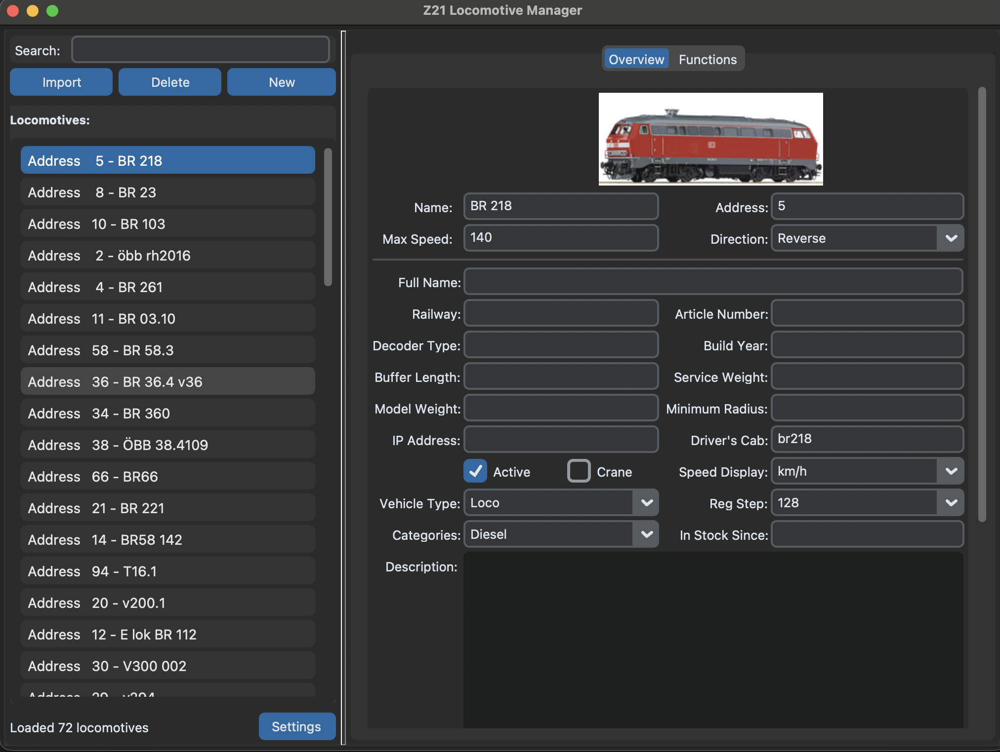
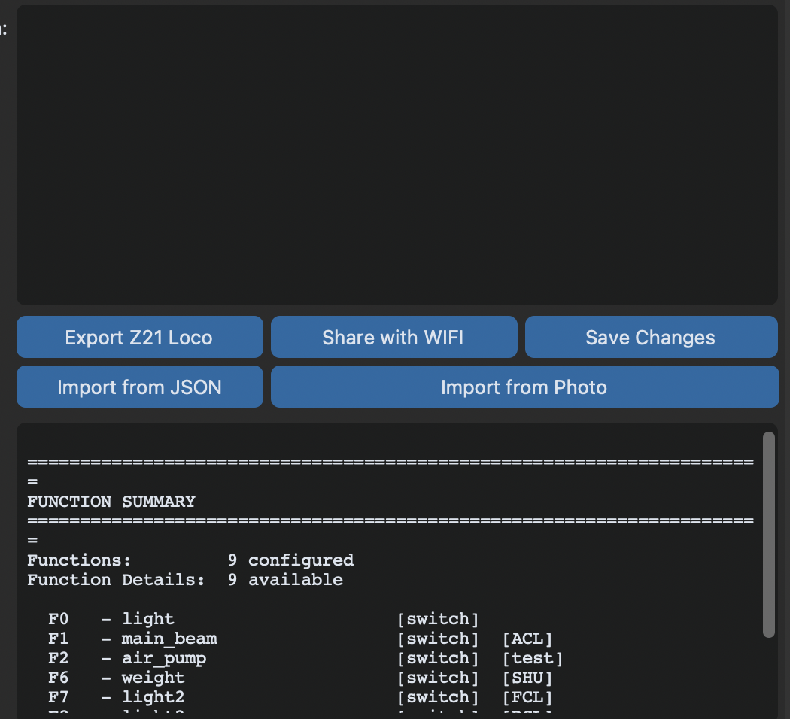
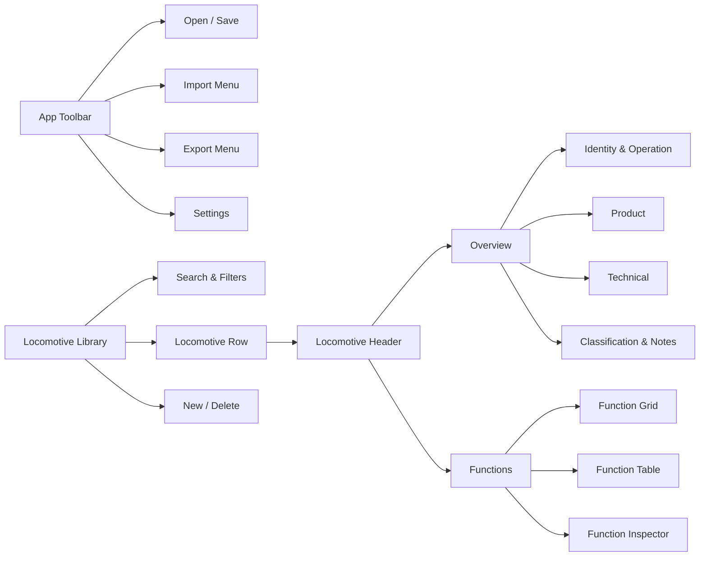

# Z21 Locomotive Manager — macOS UI 重构设计文稿

文档状态：建议稿 v1.0

目标平台：macOS 14+ / SwiftUI

设计方向：**Native Workshop（原生工作台）**

审计输入：用户提供的两张当前界面截图，以及现有 SwiftUI 工程结构

---

## 1. 设计结论

本次重构不做“换一套颜色”的表面升级，而是把应用从一个密集的数据库表单，转变为面向模型铁路玩家的 macOS 原生资料工作台。

推荐保留“左侧机车库 + 右侧详情”的核心模型，但重新建立三层层级：

1. **全局层**：打开、保存、导入、导出与设置，统一进入 macOS Toolbar 和菜单栏。
2. **对象层**：当前机车的图片、名称、地址、状态和未保存提示，集中在详情页头部。
3. **任务层**：Overview 与 Functions 分别承担资料编辑和功能映射，不再混入重复操作按钮或调试文本。

最终体验应让用户在 3 秒内回答三个问题：当前编辑的是哪台机车、是否有未保存修改、下一步最常用操作在哪里。

---

## 2. 审计范围与目标

### 用户目标

- 在 70+ 台机车中快速定位目标。
- 安全编辑地址、速度、产品资料与技术参数。
- 直观查看、添加和修正 F0–F127 功能映射。
- 从 JSON、图片、iPhone 扫描或 `.z21loco` 导入资料，并在写入前审核。
- 保存、导出和 AirDrop 时明确知道文件状态与操作结果。

### 可访问性目标

- 使用 macOS 系统语义颜色，兼容浅色、深色和提高对比度模式。
- 所有核心任务可仅用键盘完成，并具备清晰焦点顺序。
- 状态不只依赖颜色表达；图标同时具备文字或 VoiceOver 标签。
- 在窗口缩小和系统文字放大后仍保持可编辑，不发生字段截断或横向滚动。

---

## 3. 现状证据审计

### 步骤 1：浏览机车库并进入 Overview

健康度：**需要重构**

#### 已有优点

- 左侧库、右侧详情的主从结构适合桌面生产力应用。
- 当前选择状态清晰，Overview / Functions 的任务边界基本成立。
- 表单覆盖字段完整，适合严谨维护 Z21 数据。
- 机车图片能够提供有效的对象识别线索。

#### UX 风险

1. Import、Delete、New 都使用同等尺寸和同等蓝色权重，危险操作与常用操作没有区分。
2. 列表每行重复展示 `Address`，降低扫描效率；名称与地址的视觉主次相反。
3. 右侧存在多层深色容器、边框与滚动区，界面显得厚重，内容层级仍不清晰。
4. 主要身份信息、产品资料、技术参数和状态开关挤在同一视觉平面，用户难以快速扫读。
5. 图片居中占据较多纵向空间，但没有与名称、地址、状态形成统一的对象页头。
6. 表单采用宽距离的左右标签布局；窗口变窄时，标签、输入框和两列结构容易互相挤压。
7. 保存、导出和导入操作位于详情区域下方，用户需要滚动或寻找才能确认下一步。

#### 可访问性风险

- 灰色边框与深灰背景的对比可能不足；仅凭截图不能确认是否满足提高对比度模式。
- 被选中行主要通过蓝色填充表达状态，应同时提供语义选中状态和 VoiceOver 提示。
- 大量嵌套滚动区域可能造成键盘焦点与滚轮目标不明确。
- 截图无法验证 Tab、方向键、快捷键、VoiceOver 标签和错误字段聚焦。

### 步骤 2：执行导入、导出、保存并查看摘要

健康度：**较差，优先处理**

#### 已有优点

- 导出、分享、保存、JSON 和图片导入入口均已暴露。
- Function Summary 能显示功能数量和映射详情，说明底层信息已经具备。

#### UX 风险

1. 五个按钮的视觉权重几乎相同，没有明确主操作；Save Changes 不应与 Import from Photo 等价。
2. `Share with WIFI` 与实际 AirDrop / 文件分享语义不一致，容易产生错误预期。
3. 大面积空白区与操作按钮割裂，无法解释这一区域当前是什么状态。
4. Function Summary 使用终端样式文本，扫描、排序、编辑和定位单个 F 键都很困难。
5. 摘要内容和 Functions 页签职责重叠，形成重复信息源。
6. 操作结果没有在截图中形成明确的成功、失败或“尚未保存”状态反馈。

#### 可访问性风险

- 等宽字符摘要对 VoiceOver 的表格语义不友好，也难以支持列级导航。
- 大按钮虽易点击，但没有体现危险程度、默认按钮和键盘快捷键。
- 文本区域中的状态与结构依赖空格和分隔线，放大字体后可能失去结构。

### 证据限制

本次审计基于静态截图与代码结构，未验证真实键盘导航、VoiceOver、缩放、错误恢复、加载性能和 Continuity Camera 系统菜单行为，因此不声称完整 WCAG 或 macOS Accessibility 合规。

---

## 4. 推荐方向：Native Workshop

### 设计原则

1. **对象先于字段**：先确认正在编辑哪台机车，再进入具体资料。
2. **保存状态始终可见**：Toolbar 保存按钮、页头状态和底部状态栏表达一致。
3. **低频能力收纳，高频任务前置**：导入来源进入分组菜单；Save、Add Function 等保持直接可达。
4. **系统控件优先**：使用 `NavigationSplitView`、Toolbar、Table、Form、Inspector、Sheet 与 SF Symbols。
5. **渐进式信息密度**：默认展示常用字段，高级技术字段可展开，但不隐藏数据。
6. **审核优先于自动应用**：OCR、DeepSeek 和 JSON 导入统一经过 Review Sheet。

### 视觉气质

- 采用 macOS 原生语义材质和系统控件，不创建自定义“网页卡片皮肤”。
- 用机车图片、状态徽标和功能图标承担识别；颜色只用于状态与选择。
- 浅色与深色模式同等设计，避免固定黑色背景或硬编码灰色。
- 整体密度为 macOS Regular：信息充足，但给对象页头和分组标题留出呼吸空间。

---

## 5. 新信息架构

### 全局导航

- **Sidebar**：机车库、搜索、筛选、数量、新建与删除。
- **Detail Header**：图片、名称、地址、类别、Active 状态、修改状态。
- **Content Switcher**：Overview / Functions，放在详情页头下方，不使用大面积 Tab 容器。
- **Toolbar**：Open、Save、Import、Export、Settings。
- **Status Bar**：后台任务、最近结果、未保存状态；不承载核心按钮。

---

## 6. 主窗口规格

### 6.1 窗口与布局

| 属性 | 规范 |
|---|---|
| 默认窗口 | 1180 × 780 pt |
| 最小窗口 | 980 × 660 pt |
| Sidebar | 最小 260、理想 300、最大 380 pt |
| Detail 内容宽度 | 自适应；表单主体建议最大 980 pt，过宽时居中 |
| 页面边距 | 20 pt |
| 分区间距 | 24 pt |
| 组件间距 | 8 / 12 / 16 pt |
| 内容滚动 | Detail 单一纵向滚动；避免表单内部再嵌套滚动 |

### 6.2 Toolbar

从左到右：

1. Sidebar Toggle（系统提供）
2. Open
3. Save — 仅在有修改时启用，支持 `⌘S`
4. 分隔
5. Import 菜单
6. Export 菜单
7. 弹性空间
8. Settings

Import 菜单按任务分组：

- **Locomotive**：Import `.z21loco`
- **Details**：JSON、Manual with iPhone、Existing PDF / Image
- **Functions**：Function JSON、Function Table with iPhone、Existing PDF / Image
- **Media**：Locomotive Image

Export 菜单：

- Export `.z21loco…`
- Export and AirDrop…

`Share with WIFI` 统一改为 `Export and AirDrop…`，与实际行为一致。

---

## 7. Sidebar：机车库

### 行结构

- 第一行：机车名称，使用 `.body` + medium，单行截断。
- 第二行：`#5` 地址徽标、类别、功能数量，例如 `#5 · Diesel · 9 functions`。
- 左侧图标：按 Electrical / Steam / Diesel / Train Bus 使用对应 SF Symbol；未知类型使用 `tram.fill`。
- 非 Active 机车降低次要文字权重，并显示 `Inactive` 文本徽标，不能只降低透明度。

### 顶部搜索与筛选

- 使用系统 `.searchable`，占位文案 `Name or address`。
- 搜索右侧提供筛选菜单：Category、Active、Has Image、Has Functions。
- 清除搜索后保持之前选择，不自动跳到第一台机车。

### 底部操作

- 左侧 `+` 新建，支持 `⌘N`。
- 删除只使用图标按钮或右键菜单，采用 destructive 角色，不与 New 同等强调。
- 右侧显示 `72 locomotives`；搜索时显示 `12 of 72`。

---

## 8. Detail Header：对象身份区

页头不参与长表单滚动，窗口宽度允许时保持可见。

### 内容

- 左：160 × 104 pt 机车图片；悬停显示 `Change Image`。
- 中：机车名称（Title 2）、Full Name（Secondary）、地址与类别徽标。
- 右：Active Toggle、未保存状态、可选的 `Save` 主按钮。
- 关键事实：Max Speed、Direction、Decoder 以三项紧凑摘要展示。

### 状态

- `Saved`：checkmark + 文本，secondary。
- `Unsaved Changes`：orange dot + 文本，并启用 Toolbar Save。
- `Saving…`：ProgressView + 文本，阻止重复保存。
- `Save Failed`：red symbol + 简短原因 + Retry。

---

## 9. Overview 页面

### 页面分组

#### A. Identity & Operation

- Name
- Address
- Max Speed + Speed Unit
- Direction
- Active
- Crane

这些字段最常编辑，应直接展开。

#### B. Product

- Full Name
- Railway
- Article Number
- Decoder / Interface
- Build Year
- In Stock Since

#### C. Technical Data

- Buffer Length
- Model Buffer Length
- Service Weight
- Model Weight
- Minimum Radius
- IP Address
- Driver's Cab
- Vehicle Type
- Regulation Step

#### D. Classification & Notes

- Categories 改为 Token / Tag 输入，而非逗号字符串。
- Description 使用带占位提示的多行编辑器。

### 表单行为

- 宽度 ≥ 900 pt：B 与 C 采用两列分区，但每个字段内部仍为“标签在上、控件在下”。
- 宽度 < 900 pt：自动回落为单列。
- 字段标签保持 `.caption` / secondary，输入值使用 `.body`。
- 数字字段使用 Formatter 与 stepper 支持；日期使用 `DatePicker`，并保留空值能力。
- 校验错误在字段下方就地显示，保存时聚焦第一个错误；不要只弹出总错误对话框。
- Advanced Technical Data 可以折叠，但折叠状态在当前会话中保持。

---

## 10. Functions 页面

终端式 Function Summary 完全移除，信息并入结构化工作区。

### 顶部工具条

- 左：`9 Functions`，存在内部缺口时显示 `Missing F3–F5` 警告标签。
- 中：Grid / Table 分段切换。
- 右：`Scan Table` 菜单、`Add Function` 主操作。

### Grid 模式

每张卡片包含：

- F 编号
- 真实 Z21 图标
- Shortcut
- Button Type 文本徽标
- Timed 类型显示秒数

交互：单击选中，双击编辑，Delete 删除，Return 打开编辑；右键菜单提供 Edit / Duplicate / Delete。

### Table 模式

列：F、Icon、Shortcut、Behavior、Time、Active。支持：

- 按 F 编号排序
- 多选
- 批量修改行为类型
- 快速定位缺失号
- 键盘上下移动

### Inspector

选中功能后从右侧显示 280–320 pt Inspector，直接编辑 Icon、Shortcut、Behavior 和 Time；窗口较窄时改用 Sheet。

### 空状态

文案：`No functions configured`

辅助说明：`Add a function manually or scan a function table from a manual.`

按钮：`Add Function`、`Scan Function Table`

---

## 11. 导入与审核流程

所有自动化导入统一为一个可预测流程，避免每种来源使用不同的对话框逻辑。

### Review Sheet

- 顶部明确来源、目标机车和不会自动保存的说明。
- 资料字段使用 `Current → Proposed` 对比。
- 功能表使用 Table，现有 F 键默认不选中，新 F 键默认选中。
- Confidence 使用文字 + 图标，不只使用颜色。
- Evidence 可展开查看，默认保持一行。
- 底部固定：Cancel、Apply Selected；Apply 显示数量，如 `Apply 8 Changes`。

### 后台状态

- OCR、DeepSeek 分析和写入均在状态栏显示可取消进度。
- 失败时保留已识别文本，允许 Retry，不要求重新扫描。

---

## 12. 视觉与组件规范

### 颜色

只使用系统语义值：

| 用途 | SwiftUI |
|---|---|
| 页面背景 | 系统 window background / `.background` |
| Sidebar | 系统 sidebar material |
| 分组背景 | `.background.secondary` 或系统 GroupBox |
| 分隔 | `.separator` |
| 主操作 | `.tint` / Accent Color |
| 成功 | `.green` + 文本/图标 |
| 警告 | `.orange` + 文本/图标 |
| 错误 | `.red` + 文本/图标 |

不使用固定纯黑大面板，不为普通操作铺满蓝色背景。

### 字体

| 层级 | 语义样式 |
|---|---|
| 页面标题 | `.title2`, semibold |
| 分区标题 | `.headline` |
| 正文 / 字段值 | `.body` |
| 标签 | `.caption`, secondary |
| 状态 / 元数据 | `.caption2`, secondary |
| OCR 原文 | `.body`, monospaced，仅用于原文审核 |

### 间距与圆角

- 基础间距：4 pt
- 常用间距：8、12、16、24、32 pt
- 输入控件与系统 GroupBox 保留系统圆角。
- 自定义图片与功能卡片：10–12 pt；不要在同一层级混用多个半径。

### 控件

- 默认 Regular Control Size。
- 图标按钮最小命中区域 28 × 28 pt；高频按钮建议 32 pt 高。
- 破坏性操作必须使用 destructive role 和确认文案。
- 所有图标按钮提供 `.help` 与 accessibility label。

---

## 13. 页面与状态清单

| ID | 页面 / 状态 | 主任务 | 主操作 |
|---|---|---|---|
| S01 | Library + Overview | 浏览和编辑机车资料 | Save |
| S02 | Functions Grid | 浏览、添加、编辑功能 | Add Function |
| S03 | Functions Table | 批量检查和修正映射 | Apply / Edit |
| S04 | Import Source | 选择导入来源 | Continue |
| S05 | OCR Review | 审核原始识别文本 | Analyze |
| S06 | Field Review | 对比并选择字段建议 | Apply Changes |
| S07 | Function Review | 审核 F 表与图标匹配 | Apply Functions |
| S08 | Image Crop | 裁切机车图片 | Save Crop |
| S09 | Settings | 管理 DeepSeek Key | Save Key |
| S10 | Empty Archive | 引导首次新建或导入 | New Locomotive |

每一页都需要覆盖 loading、empty、error、success 和 unsaved 状态。

---

## 14. 文案调整

| 当前文案 | 建议文案 | 原因 |
|---|---|---|
| Share with WIFI | Export and AirDrop… | 与真实系统行为一致 |
| Import from Photo | Import Manual… | 入口包含扫描、拍照和现有文件 |
| Scan from iphone | Scan with iPhone… | 品牌大小写与动作更准确 |
| Save Changes | Save | macOS Toolbar 已提供对象上下文 |
| Export Z21 Loco | Export `.z21loco`… | 明确格式 |
| Function Summary | 9 Functions | 移除调试语气，改为结构化信息 |
| Reg Step | Regulation Step | 避免缩写歧义 |
| Driver's Cab | Driver’s Cab | 使用统一排版与标点 |

应用当前为英文界面；建议所有字符串进入 `Localizable.xcstrings`，为后续中文和德文界面做准备。

---

## 15. SwiftUI 组件映射

### 建议新增文件

| 文件 | 职责 |
|---|---|
| `DesignTokens.swift` | 间距、页面宽度和语义布局常量，不封装系统颜色 |
| `LibrarySidebar.swift` | 搜索、筛选、机车行和底部操作 |
| `LocomotiveHeader.swift` | 图片、名称、状态、关键事实 |
| `OverviewWorkspace.swift` | 四个资料分区和自适应布局 |
| `FunctionWorkspace.swift` | Grid / Table / Inspector |
| `ImportSourceMenu.swift` | 分组导入入口 |
| `ReviewChangeRow.swift` | Current / Proposed / Evidence 对比组件 |
| `StatusPresenter.swift` | Saving、Success、Warning、Failure 状态 |

### 现有文件调整

- `ContentView.swift`：只承担窗口骨架、Toolbar、Sidebar / Detail 路由。
- `ReviewViews.swift`：拆分 OCR、字段审核、功能审核；统一 Sheet Header 与 Footer。
- `ImageCropper.swift`：保留图像逻辑，编辑器使用可拖动裁切框，并支持重置。
- `AppState.swift`：将一次性字符串状态改为带类型的 `AppStatus`，供 UI 语义展示。

---

## 16. 键盘与可访问性规范

### 快捷键

- `⌘O` Open
- `⌘S` Save
- `⌘N` New Locomotive
- `⌘F` Focus Search
- `⌘1` Overview
- `⌘2` Functions
- `⌘⇧I` Import
- `⌘E` Export
- `Delete` 删除当前选中功能；删除机车需 `⌘Delete` 并确认

### 焦点顺序

1. Toolbar
2. Sidebar Search / Filters
3. Locomotive List
4. Detail Header
5. Content Switcher
6. 当前页面字段或功能列表
7. Status Bar

### VoiceOver

- 机车行示例：`BR 218, address 5, Diesel, active, 9 functions, selected`。
- 功能卡示例：`F1, main beam, switch, shortcut ACL`。
- 保存状态示例：`Unsaved changes for BR 218`。
- Confidence 示例：`92 percent confidence, evidence available`。

---

## 17. 验收标准

### 结构与可用性

- 首屏不滚动即可看到当前机车身份、保存状态和 Overview / Functions 导航。
- New、Delete、Import、Save 不再拥有相同视觉权重。
- Sidebar 行不重复展示 `Address` 标签，名称成为第一扫描入口。
- Overview 在 980 pt 最小窗口宽度下不出现横向滚动或字段截断。
- Function Summary 不再以终端文本出现；所有信息可在 Grid 或 Table 中访问。
- 导入建议在应用前始终展示 Current / Proposed 对比。

### 状态与安全

- 所有数据修改会立即显示 Unsaved Changes。
- 保存成功、失败和进行中均有文字与图标反馈。
- 删除机车、覆盖现有 F 键和放弃修改均有明确确认。
- OCR 或 AI 失败后保留原始识别结果，可直接重试。

### 可访问性

- 所有核心任务可以只使用键盘完成。
- 提高对比度模式下分隔、选中、错误状态仍可辨识。
- VoiceOver 能读出列表行、功能卡、审核建议和保存状态。
- 200% 文字缩放后核心内容不重叠、不裁切。

---

## 18. 实施优先级

### P0 — 结构重构

1. Toolbar 操作分级与文案修正。
2. Sidebar 行结构和搜索筛选。
3. Locomotive Header 与保存状态。
4. Overview 四分区与响应式单/双列。
5. Functions Grid / Table 替换文本摘要。

### P1 — 工作流统一

1. 统一 Import Menu。
2. 统一 OCR / DeepSeek / JSON Review Sheet。
3. Current / Proposed 字段对比。
4. Function Inspector 与批量操作。

### P2 — 完整体验

1. 键盘导航与 VoiceOver 优化。
2. 本地化字符串。
3. 空状态、错误恢复和进度取消。
4. 视觉回归测试与浅色 / 深色 / 高对比度检查。

---

## 19. 推荐的第一版范围

第一轮实现建议只聚焦 S01、S02、S05–S07：主窗口、Overview、Functions，以及三种审核 Sheet。它们覆盖日常使用频率最高、当前摩擦最大、也最能建立新设计语言的部分。Settings 与 Image Crop 可沿用现有 SwiftUI 结构，在第二轮统一视觉。

该方向不会改变 Z21 数据模型、SQLite 写入或 OCR / DeepSeek 逻辑，主要重构视图层和状态表达，因此可以沿用当前测试，并额外补充 UI 状态测试与可访问性标识测试。
